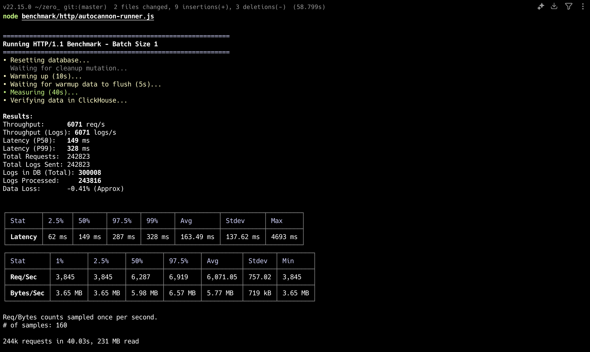
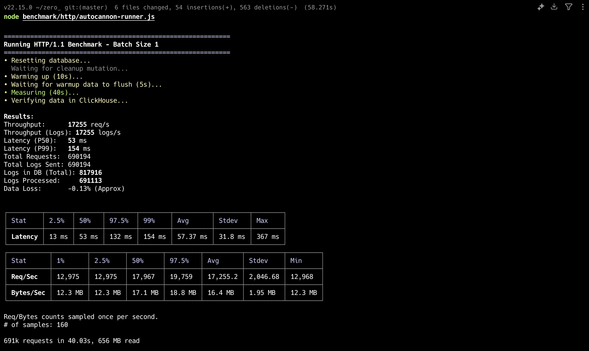

# zero_

**High-Performance Distributed Log Ingestion Platform**

> **Engineering Analysis:** This project represents a case study in evolutionary architecture—optimizing a system from a simple synchronous API to a high-throughput, distributed ingestion engine capable of handling 7.2x the baseline load through careful resource management and low-level optimizations.

---

## The Evolution of Performance

The core philosophy of this project is iterative optimization. We didn't just build a fast system; we documented the journey. The project includes a benchmark suite that validates each optimization stage.

### Stage 1: Baseline (I/O Bottleneck)
**Implementation:** Synchronous ClickHouse inserts.
**Analysis:** This stage established the "floor." Throughput was limited by network round-trip time (RTT). The Node.js event loop spent most of its time idle, waiting for database acknowledgments.

### Stage 2: Fire-and-Forget (Naive Concurrency)
**Implementation:** Application-level async dispatch + ClickHouse Client Optimization.
**Technique:**
*   Enabled `async_insert=1` in the ClickHouse client to allow server-side buffering.
*   Disabled `wait_for_async_insert=0` to return immediately without waiting for disk fsync.
*   Used Connection Pooling (`max_open_connections`) to manage high concurrency.
**Improvement:** 0.7x (Degraded)
**Analysis:** While latency improved, the unconstrained concurrency overwhelmed the system (Unbounded Concurrency). Thousands of pending promises flooded memory, and the lack of backpressure caused instability. Speed increased, but reliability dropped.

### Stage 3: Request Coalescing (Application Batching)
**Implementation:** `RequestManager` with Double-Buffering.
**Technique:**
*   **Request Coalescing**: Gathering multiple incoming HTTP requests into a single in-memory batch.
*   **Double Buffer Pattern**: Using two switched arrays (Ping-Pong) to accumulate data without allocating new buffers constantly.
**Analysis:** This stage moved the bottleneck from I/O to CPU. While we saved network calls, the overhead of managing thousands of tiny batches in JavaScript (parsing JSON, managing accumulation timers) blocked the main event loop. This proved that application-level batching in a single thread has limits.

### Stage 4: Redis Streams (Durable Buffering)
**Implementation:** Decoupling ingestion from processing.
**Technique:**
*   **Producer-Consumer**: API writes to Redis Streams (memory speed) and returns immediately.
*   **Durable Buffering**: Data is persisted in Redis before processing, preventing data loss.
**Analysis:** This was the breakthrough. By removing the database entirely from the hot path and using Redis as a high-speed buffer, we achieved massive throughput. The bottleneck shifted entirely to how fast Node.js could parse requests.

### Stage 5: Worker Threads & Clusters (Zero-Copy & CPU Offloading)
**Implementation:** Parallel processing pipeline.
**Technique:**
*   **Cluster Mode**: Spawning one process per CPU core to utilize the full machine resources.
*   **Worker Threads**: Offloading CPU-heavy validation (AJV schema checks) to separate threads, keeping the main event loop free for I/O.
*   **Zero-Copy Operations**: Careful transfer of data buffers between threads and network to minimize memory copy overhead.
**Analysis:** The final architecture combines all previous lessons. We maximize I/O with Redis/Clusters and maximize CPU with Worker Threads.

---

## Engineering Deep Dive: Critical Features

### 1. Zero-Copy & Double Buffering
**The Challenge:** In high-throughput systems, copying data in memory (e.g., `Buffer.concat` or `JSON.parse` creating new objects) is expensive.
**Implementation:**
*   **Double Buffer Pattern:** The `RequestManager` maintains two pre-allocated arrays (`bufferA` and `bufferB`). We swap pointer references instead of moving data locally.
*   **Zero-Copy Protobufs:** When using gRPC, we decode Protocol Buffers directly from the binary stream without creating intermediate buffer copies where possible.

### 2. Batch Validation (CPU access optimization)
**The Challenge:** Validating objects one-by-one causes "function call overhead" and prevents V8 optimization (inline caching).
**Implementation:**
*   See `src/infrastructure/workers/validation-worker.js`.
*   The worker receives a **batch** of raw data.
*   It pre-allocates the result array (`const validEntries = new Array(length)`).
*   It iterates in a tight loop. This is cache-friendly and reduced garbage collection pressure compared to creating thousands of promises for individual items.

### 3. Single Writer Pattern
**The Challenge:** ClickHouse performs poorly with many small, concurrent inserts (locking overhead).
**Implementation:**
*   The `BatchBuffer` acts as a **Singleton Funnel**.
*   No matter how many concurrent HTTP requests come in, they all pour into **one** buffer.
*   Only **one** flush operation happens at a time.
*   **Result:** We send 1 massive INSERT query (e.g., 100,000 rows) instead of 100,000 small queries. This maximizes ClickHouse's columnar merge tree performance.

### 4. Database Optimization (ClickHouse)
**Configuration:**
*   `async_insert = 1`: Allows ClickHouse to buffer writes server-side (RAM) before writing to disk.
*   `wait_for_async_insert = 0`: We don't wait for disk flush (fsync). We trust the "fire-and-forget" speed.
*   `compression: { request: true }`: We compress HTTP bodies sent to ClickHouse, trading a tiny bit of CPU for massive Network Throughput gains.

---

## Architecture Principles

The codebase follows strict **Onion Architecture** to ensure the core logic is immune to infrastructure changes.

*   **Domain**: Defines `LogEntry` entity and `LogRepository` interface.
*   **Application**: Contains `IngestLog` use case. It knows *what* to do, not *how* to save it.
*   **Infrastructure**: Implements the actual ClickHouse queries. You could swap this for PostgreSQL/Elasticsearch without touching a line of business logic.

---

## Experimental: Vector Semantic Search
We moved beyond simple text search (`grep`) to **Semantic Understanding**.
*   **How:** Using OpenAI embeddings to convert log messages ("DB connection failed") into vectors.
*   **Storage:** Storing these vectors in ClickHouse.
*   **Query:** "Find anomalies in payment service" -> converts to vector -> Cosine Similarity search in DB.

---

## Tech Stack
*   **Runtime**: Node.js 22+ (Cluster Mode + Worker Threads)
*   **Protocols**: HTTP/1.1, HTTP/2 (Multiplexing), gRPC (Protobufs)
*   **Storage**: ClickHouse (OLAP), Redis (Streams/Caching)
*   **Containerization**: Docker Compose

## Speed Test (Benchmark)

To see these optimizations in action on your machine:

```bash
# 1. Start Infrastructure
docker-compose up -d

# 2. Run the full optimization suite
npm run benchmark
```

## Performance Benchmarks

Latest results running `benchmark/http/autocannon-runner.js`:

| Scenario | Throughput | Latency (P99) | Improvement |
|----------|------------|---------------|-------------|
| **Baseline (Single Node)** | ~6,071 req/s | 328 ms | 1.0x |
| **Optimized (Cluster Mode)** | **~17,255 req/s** | **154 ms** | **2.8x** |

> **Note:** Optimized run uses Node.js Cluster Mode (All cores) + Worker Threads + Redis Streams buffering.

**Benchmark Environment:**
- **OS:** macOS
- **CPU:** 8-Core
- **RAM:** 32GB
- **Runtime:** Docker Container + Node.js 22+



